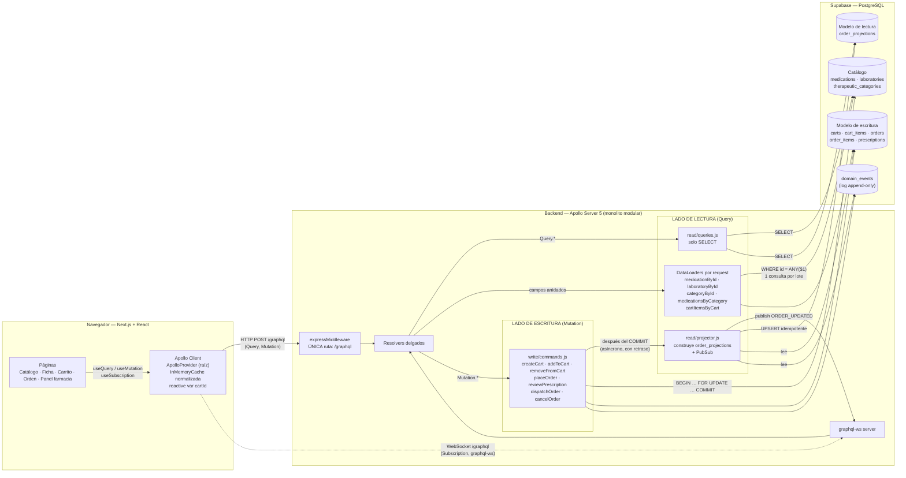
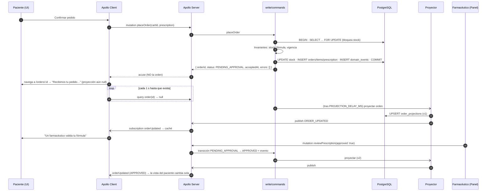
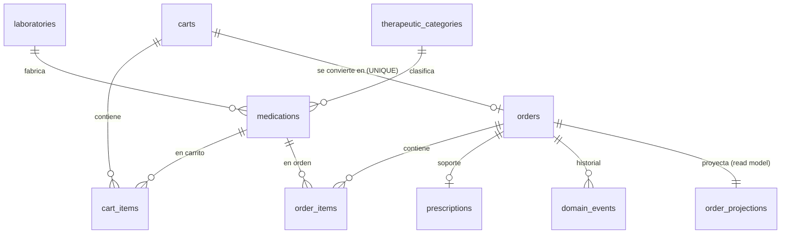

# 💊 Afirmative Pill — E-commerce farmacéutico con GraphQL + CQRS

Solución al **Taller Práctico Avanzado "Afirmative Pill"** (Ingeniería de Software Avanzada / Patrones Arquitectónicos).

| Capa | Tecnología |
|---|---|
| Frontend | Next.js 16 (App Router) + React 19 + **Apollo Client 4** (`ApolloProvider` en la raíz) |
| Backend | **Apollo Server 5** sobre Express 5 (monolito modular) + `graphql-ws` para Subscriptions |
| N+1 | **DataLoader** por request |
| Persistencia | **PostgreSQL en Supabase** (driver `pg`) |
| Patrón | **CQRS** con modelo de escritura transaccional, log de eventos y proyecciones de lectura |

> Este README explica **todas** las decisiones: qué se hizo, cómo se implementó y por qué. Al final está la **definición completa del Schema SDL**.

---

## Índice

1. [Cómo cumple la rúbrica (resumen)](#1-cómo-cumple-la-rúbrica-resumen)
2. [Diagrama de arquitectura](#2-diagrama-de-arquitectura)
3. [Estructura del repositorio](#3-estructura-del-repositorio)
4. [Instrucciones de arranque](#4-instrucciones-de-arranque)
5. [Criterio 1 — Diseño e implementación de GraphQL (40 %)](#5-criterio-1--diseño-e-implementación-de-graphql-40-)
6. [Criterio 2 — Arquitectura CQRS y modelo de dominio (25 %)](#6-criterio-2--arquitectura-cqrs-y-modelo-de-dominio-25-)
7. [Criterio 3 — Frontend con Apollo Client & Context (20 %)](#7-criterio-3--frontend-con-apollo-client--context-20-)
8. [Criterio 4 — Persistencia en Supabase, calidad y sustentación (15 %)](#8-criterio-4--persistencia-en-supabase-calidad-y-sustentación-15-)
9. [Historias de usuario: escenarios A, B y C](#9-historias-de-usuario-escenarios-a-b-y-c)
10. [Pruebas automatizadas](#10-pruebas-automatizadas)
11. [Guion para el video de sustentación](#11-guion-para-el-video-de-sustentación)
12. [Limitaciones conocidas y decisiones conscientes](#12-limitaciones-conocidas-y-decisiones-conscientes)
13. [Schema SDL completo (`schema.graphql`)](#13-schema-sdl-completo-schemagraphql)

---

## 1. Cómo cumple la rúbrica (resumen)

| Criterio | Exigencia | Cómo se resolvió | Dónde |
|---|---|---|---|
| **1. GraphQL (40 %)** | Schema SDL riguroso | 3 **scalars propios** (`DateTime`, `Money`, `PositiveInt`), 6 **enums**, 7 **inputs**, 3 **payloads** tipados, error de dominio tipado `UserError` con `ErrorCode` | [`backend/src/schema.graphql`](backend/src/schema.graphql), [`backend/src/scalars.js`](backend/src/scalars.js) |
| | Queries contra over-fetching | Un solo tipo `Medication`; la vista de catálogo pide 6 campos (fragmento `MedicationCard`), la ficha pide el resto. Paginación por cursor | [`frontend/lib/operations.js`](frontend/lib/operations.js) |
| | Mutations orientadas a intención + errores ricos | `placeOrder`, `reviewPrescription`, `dispatchOrder`, `cancelOrder`, `addToCart`… Respuestas `{ …, errors: [UserError] }` con `code`, `message`, `field` (ruta del input) y `medicationId` | [`backend/src/write/commands.js`](backend/src/write/commands.js) |
| | Mitigación N+1 | 5 DataLoaders creados **por request** (batching + caché por request). Logs demuestran `N claves → 1 consulta SQL` | [`backend/src/loaders.js`](backend/src/loaders.js) |
| | Zero-REST | El servidor tiene **una sola ruta**: `/graphql` (HTTP y WebSocket). Todo lo demás → 404. En Supabase se **bloquea PostgREST** (RLS sin políticas + `REVOKE`) | [`backend/src/index.js`](backend/src/index.js), [`supabase/schema.sql`](supabase/schema.sql) |
| **2. CQRS (25 %)** | Segregación conceptual y técnica | `Query` → `src/read/` (solo SELECT, lee **proyecciones**); `Mutation` → `src/write/` (transacciones + eventos). Tablas separadas: `orders`/`order_items` (escritura) vs `order_projections` (lectura). `placeOrder` **no** devuelve la orden, solo un acuse | [`backend/src/read/`](backend/src/read), [`backend/src/write/`](backend/src/write) |
| | Invariantes farmacéuticas | Fórmula obligatoria, fórmula válida (registro, documento, vigencia ≤ 30 días), stock suficiente con **bloqueo de fila**, `CHECK (stock >= 0)`, máquina de estados, "una orden con fórmula solo se aprueba por un farmacéutico", idempotencia (`UNIQUE cart_id`) | [`commands.js`](backend/src/write/commands.js), [`schema.sql`](supabase/schema.sql) |
| | Consistencia eventual | Log `domain_events` → proyector asíncrono (retraso configurable) → `order_projections` → Subscription. La UI muestra un estado "pedido recibido" mientras la proyección no existe, hace *polling* hasta que aparece y luego se actualiza por WebSocket. Recuperación al arrancar (*catch-up*) | [`projector.js`](backend/src/read/projector.js), [`orders/[id]/page.js`](frontend/app/orders/[id]/page.js) |
| **3. Apollo Client (20 %)** | `ApolloProvider` en la raíz | `app/layout.js` envuelve todo el árbol con `<Providers>` → `<ApolloProvider client>` | [`frontend/app/providers.js`](frontend/app/providers.js) |
| | Hooks idiomáticos + estados | `useQuery`, `useMutation`, `useSubscription`, `subscribeToMore`, `fetchMore`, `useReactiveVar`; cada pantalla maneja `loading` / `error` / `data` | [`frontend/app/`](frontend/app) |
| | Actualización inteligente de caché | Normalización automática, `cache.writeQuery`, `cache.modify`, `cache.evict` + `gc`, `optimisticResponse`, `typePolicies` con `merge` de paginación | ver [§7.4](#74-actualización-de-la-caché-después-de-cada-mutation) |
| **4. Supabase (15 %)** | Dataset de 50 medicamentos cargado | `supabase/seed.sql` (50 medicamentos reales del mercado colombiano, 15 laboratorios, 13 categorías) | [`supabase/seed.sql`](supabase/seed.sql) |
| | Consultas bien indexadas | Índices GIN `pg_trgm` para búsqueda `ILIKE`, índices B-tree para filtros facetados, FKs de los DataLoaders y listados de proyección | [§8.2](#82-índices-y-por-qué-cada-uno) |
| | Repo limpio + diagrama + arranque + justificación | Este README | — |

---

## 2. Diagrama de arquitectura



### Flujo de una compra (secuencia CQRS)



---

## 3. Estructura del repositorio

```
Afirmative-Pill/
├── supabase/
│   ├── schema.sql            # Tablas, índices, enums, RLS (bloqueo de PostgREST)
│   └── seed.sql              # 50 medicamentos + laboratorios + categorías
├── backend/
│   ├── src/
│   │   ├── index.js          # Express + Apollo Server + WebSocket. ÚNICA ruta /graphql
│   │   ├── schema.graphql    # Contrato SDL (fuente de verdad del API)
│   │   ├── scalars.js        # DateTime, Money, PositiveInt
│   │   ├── resolvers.js      # Resolvers delgados: Query→read, Mutation→write, anidados→DataLoader
│   │   ├── loaders.js        # DataLoaders por request (anti N+1)
│   │   ├── db.js             # Pool pg, helper sql() con log, transaction()
│   │   ├── read/
│   │   │   ├── queries.js    # LADO DE LECTURA: solo SELECT (catálogo + proyecciones)
│   │   │   └── projector.js  # Construye order_projections desde eventos + PubSub
│   │   └── write/
│   │       └── commands.js   # LADO DE ESCRITURA: comandos, invariantes, máquina de estados
│   ├── test/flow.test.js     # Pruebas E2E (solo GraphQL) de invariantes y consistencia
│   └── .env.example
└── frontend/
    ├── app/
    │   ├── layout.js         # Raíz: <Providers> (ApolloProvider) + <Nav>
    │   ├── providers.js      # Crea el ApolloClient una vez y lo provee al árbol
    │   ├── nav.js            # Badge del carrito (lee la caché)
    │   ├── add-to-cart.js    # Botón reutilizable (useMutation)
    │   ├── page.js           # Escenario A: catálogo, búsqueda, filtros, "cargar más"
    │   ├── medications/[id]/page.js  # Escenario A: ficha técnica
    │   ├── cart/page.js      # Escenario B: carrito + fórmula + placeOrder
    │   ├── orders/[id]/page.js       # Escenario C: proyección + tiempo real
    │   ├── orders/page.js    # Panel de farmacia: aprobar/rechazar/despachar/cancelar
    │   └── globals.css
    └── lib/
        ├── apollo.js         # ApolloClient: split HTTP/WS, typePolicies
        ├── operations.js     # Todas las operaciones y fragmentos GraphQL
        ├── cart.js           # Reactive var cartId + hook useCart
        └── format.js         # Formato COP, fechas, etiquetas
```

**Por qué esta organización:** la separación CQRS se ve en el árbol de carpetas (`read/` vs `write/`) y no solo en el discurso. Los resolvers no contienen lógica de negocio: solo enrutan. Así un evaluador puede abrir `write/commands.js` y encontrar **todas** las reglas del dominio en un solo lugar.

---

## 4. Instrucciones de arranque

### Requisitos
- Node.js **≥ 22** (se usa `--env-file-if-exists` y `fetch` nativos; probado con Node 24).
- Una cuenta de Supabase (plan gratuito sirve).

### 4.1 Base de datos (Supabase)
1. Crear un proyecto en <https://supabase.com>.
2. Ir a **SQL Editor → New query**, pegar y ejecutar [`supabase/schema.sql`](supabase/schema.sql).
3. Nueva query: pegar y ejecutar [`supabase/seed.sql`](supabase/seed.sql). La última línea debe devolver `medicamentos_cargados = 50`.
4. Copiar la cadena de conexión: **Project Settings → Database → Connection string → Session pooler (URI)**.

### 4.2 Backend
```bash
cd backend
cp .env.example .env        # pegar DATABASE_URL de Supabase
npm install
npm run dev                 # http://localhost:4000/graphql  (HTTP + WS)
```
Variables (todas documentadas en `.env.example`):

| Variable | Default | Para qué |
|---|---|---|
| `DATABASE_URL` | — | Cadena de conexión de Supabase |
| `DATABASE_SSL` | `true` | Supabase exige SSL |
| `PORT` | `4000` | Puerto del API |
| `CORS_ORIGIN` | `http://localhost:3000` | Origen del frontend |
| `PROJECTION_DELAY_MS` | `1500` | Retraso artificial del proyector (hace visible la consistencia eventual) |
| `PAYMENT_DELAY_MS` | `4000` | Tiempo de la "pasarela de pago" simulada para órdenes sin fórmula |
| `LOG_SQL` | `true` | Imprime cada SQL (evidencia del batching de DataLoader) |

### 4.3 Frontend
```bash
cd frontend
cp .env.example .env.local  # NEXT_PUBLIC_GRAPHQL_URL=http://localhost:4000/graphql
npm install
npm run dev                 # http://localhost:3000
```

### 4.4 Pruebas
```bash
cd backend
npm test                    # usa la DATABASE_URL del .env; levanta el servidor en :4100
```

---

## 5. Criterio 1 — Diseño e implementación de GraphQL (40 %)

### 5.1 Principios del diseño del schema

1. **El schema es el contrato y la fuente de verdad.** Se escribió primero en SDL (`schema.graphql`, *schema-first*) y se carga con `makeExecutableSchema`. Toda la documentación de negocio vive en las descripciones (`"""…"""`) y por eso aparece en Apollo Sandbox / introspección.
2. **El schema refleja CQRS**: `Query` = lecturas y proyecciones, `Mutation` = comandos con intención de negocio, `Subscription` = notificación de cambios en proyecciones.
3. **Nombres de dominio, no de CRUD**: no existe `updateOrder(status:)`. Existen `placeOrder`, `reviewPrescription`, `dispatchOrder`, `cancelOrder`. Así el servidor controla *qué transiciones son legales*, en lugar de que el cliente escriba estados arbitrarios.
4. **Nulabilidad deliberada**: todo lo que siempre existe es `!`. `Query.order(id)` es **nullable a propósito**: `null` significa "la proyección todavía no se materializa" (consistencia eventual) o "no existe".

### 5.2 Scalars personalizados

| Scalar | Por qué existe | Validación (en `scalars.js`) |
|---|---|---|
| `DateTime` | Un `String` no dice nada del formato. Con `DateTime` el contrato garantiza ISO-8601 y el resolver recibe un `Date` real | Rechaza strings no parseables en `parseValue`/`parseLiteral`; serializa siempre con `toISOString()` |
| `Money` | El precio no es un `Float` cualquiera: es dinero en COP, no negativo, con 2 decimales | Rechaza negativos / no numéricos; redondea a 2 decimales |
| `PositiveInt` | Las cantidades de un carrito deben ser > 0. Con este scalar, una cantidad `0` o `-3` **ni siquiera llega al resolver** | Rechaza no enteros y ≤ 0 con `BAD_USER_INPUT` |

Decisión: se implementaron a mano (≈ 50 líneas) en lugar de agregar la dependencia `graphql-scalars`, porque la rúbrica evalúa precisamente el diseño de scalars propios y son triviales de mantener.

### 5.3 Enums

`OrderStatus` (los 4 estados que pide el enunciado), `StockStatus` (`IN_STOCK`/`LOW_STOCK`/`OUT_OF_STOCK`: la vista condensada no necesita el número exacto de unidades), `CartStatus`, `MedicationSort` y `ErrorCode`.
**Por qué enums y no strings:** el cliente puede hacer `switch` exhaustivo, la introspección documenta los valores válidos y GraphQL rechaza valores inválidos antes de ejecutar nada.

### 5.4 Inputs y Payloads tipados

- **Un `input` por comando** (`AddToCartInput`, `PlaceOrderInput`, `ReviewPrescriptionInput`, `CancelOrderInput`, …). Permite evolucionar el comando agregando campos opcionales sin romper clientes.
- `PrescriptionInput` agrupa el soporte de la fórmula; es **opcional en el schema** pero **obligatorio por regla de negocio** si algún ítem lo requiere. Esa regla no se puede expresar en SDL (depende del contenido del carrito), por eso vive en el comando y se reporta como error de dominio.
- **Payloads** (`CartPayload`, `PlaceOrderPayload`, `OrderCommandPayload`): todos incluyen `errors: [UserError!]!`.

### 5.5 Errores de validación ricos: por qué en el payload y no en `errors` de GraphQL

Hay dos tipos de fallo y se tratan distinto:

| Tipo | Ejemplo | Dónde viaja | Por qué |
|---|---|---|---|
| **Error de dominio esperado** | Sin stock, falta fórmula, fórmula vencida, transición inválida | `payload.errors: [UserError]` con `code`, `message`, `field`, `medicationId` | Es un resultado de negocio legítimo. Queda tipado en el schema, el cliente lo consulta como cualquier campo y decide UX por `code` (no por texto) |
| **Error técnico / input malformado** | BD caída, `PositiveInt = -1`, cursor corrupto | `errors` de GraphQL (con `extensions.code`) | Es excepcional; no es parte del flujo de negocio |

`UserError.field` es la **ruta al campo del input** (p. ej. `["input","prescription","doctorLicense"]`), con lo que el frontend pinta el mensaje **debajo del campo exacto**. `medicationId` permite resaltar **la fila del carrito** que falló. Además, `placeOrder` **acumula todos los errores** (stock de varios ítems + fórmula) en una sola respuesta para que el paciente los corrija de una vez.

Ejemplo real:
```graphql
mutation { placeOrder(input: { cartId: "…", prescription: { doctorName: "Dra. Ana", doctorLicense: "??",
  patientDocument: "1020304050", issuedAt: "2020-01-01T00:00:00Z" } }) {
  orderId errors { code message field medicationId } } }
```
```json
{ "orderId": null, "errors": [
  { "code": "INVALID_PRESCRIPTION", "message": "Registro médico inválido (4-20 caracteres alfanuméricos o guiones)", "field": ["input","prescription","doctorLicense"], "medicationId": null },
  { "code": "INVALID_PRESCRIPTION", "message": "La fórmula está vencida (más de 30 días)", "field": ["input","prescription","issuedAt"], "medicationId": null } ] }
```

### 5.6 Queries contra el over-fetching

- **Un único tipo `Medication`**, no dos (`MedicationSummary` / `MedicationDetail`). En GraphQL el tamaño de la respuesta lo decide **la selección del cliente**, no el tipo. Duplicar tipos sería reintroducir la rigidez de REST.
- La **vista condensada** del catálogo usa el fragmento `MedicationCard` → **6 campos** (`id commercialName presentation price requiresPrescription stockStatus`). Las indicaciones, contraindicaciones, laboratorio y categoría **no viajan**.
- La **ficha técnica** (`MedicationDetail`) reutiliza `MedicationCard` y agrega los campos clínicos y las relaciones.
- Relaciones (`laboratory`, `category`) solo se resuelven si se piden: si el catálogo no las pide, **no se ejecuta ni una consulta SQL extra**.
- **Paginación por cursor** (`first`/`after` → `MedicationConnection { nodes pageInfo totalCount }`), límite duro `first ≤ 50` validado en el servidor (protección contra consultas abusivas). `totalCount` se obtiene con `count(*) over()` en **la misma consulta**.
- **Búsqueda facetada**: `MedicationFilter { search, categoryId, requiresPrescription, inStockOnly }` + `MedicationSort`.

### 5.7 Mitigación del problema N+1 (DataLoader)

**El problema:** la query
```graphql
{ therapeuticCategories { name medications(first: 2) { commercialName laboratory { name } } } }
```
ingenuamente ejecuta 1 consulta de categorías + 13 (medicamentos por categoría) + 26 (laboratorio por medicamento) = **40 consultas**.

**La solución** ([`backend/src/loaders.js`](backend/src/loaders.js)):

| Loader | Consulta en lote | Usado por |
|---|---|---|
| `medicationById` | `… FROM medications WHERE id = ANY($1)` | `CartItem.medication`, `OrderItem.medication`, `Query.medication` |
| `laboratoryById` | `… FROM laboratories WHERE id = ANY($1)` | `Medication.laboratory` |
| `categoryById` | `… FROM therapeutic_categories WHERE id = ANY($1)` | `Medication.category` |
| `medicationsByCategory` (1:N) | `… WHERE category_id = ANY($1)` | `TherapeuticCategory.medications` y `.medicationCount` |
| `cartItemsByCart` (1:N) | `… FROM cart_items JOIN medications WHERE cart_id = ANY($1)` | `Cart.items`, `.total`, `.itemCount`, `.requiresPrescription` |

Log real del servidor para esa query (con `LOG_SQL=true`):
```
[GraphQL] query (anónima)
  [SQL #5] select id, name, description from therapeutic_categories order by name [] → 13 filas
  [DataLoader] medicationsByCategory: 13 claves agrupadas → 1 consulta SQL
  [SQL #6] select m.id, m.commercial_name … where m.category_id = any($1) … [[1,8,3,5,2,4,13,11,7,6,9,10,12]] → 50 filas
  [DataLoader] laboratoryById: 12 claves agrupadas → 1 consulta SQL
  [SQL #7] select id, name, country from laboratories where id = any($1) [[1,8,7,2,12,10,15,6,3,5,4,13]] → 12 filas
```
**40 consultas → 3.** El número de consultas depende de la **profundidad** de la query, no de la cantidad de filas.

**Decisiones clave:**
- **Loaders nuevos en cada operación** (`context: () => ({ loaders: createLoaders() })`, tanto en HTTP como en WebSocket). Así la caché del DataLoader dura *un request*: deduplica dentro de la operación pero **nunca** sirve datos rancios entre requests ni filtra datos entre usuarios.
- **Cebado (`prime`)**: `Query.medications` guarda cada fila en `medicationById`; si la misma operación vuelve a pedir esos ids, no hay consulta.
- `cacheKeyFn` normaliza las claves (`"3"` y `3` son la misma clave: los `ID` de GraphQL llegan como string, las FK de Postgres como número).
- Los ítems de la **proyección** de órdenes vienen desnormalizados (nombre, presentación, precio), así que listar 30 órdenes con sus ítems es **1 consulta**; solo si el cliente pide `OrderItem.medication` entra el DataLoader.

### 5.8 Zero-REST (cumplimiento total)

| Capa | Medida |
|---|---|
| **Backend** | `index.js` registra **una sola ruta**: `app.use('/graphql', …)`. No hay `app.get`/`app.post` de ningún recurso. Cualquier otra URL devuelve **404** (`curl localhost:4000/api/medications → 404`). Las Subscriptions usan WebSocket en **la misma ruta** `/graphql`. |
| **Frontend** | No existe ninguna carpeta `app/api/` (Route Handlers de Next). Ningún `fetch` manual: toda comunicación pasa por Apollo Client (`HttpLink` + `GraphQLWsLink`). Catálogo, carrito, órdenes y tiempo real: todo son operaciones GraphQL. |
| **Supabase** | Supabase expone automáticamente **cada tabla como API REST** (PostgREST). Eso violaría el mandato aunque nadie la usara. `schema.sql` activa **RLS sin políticas** y hace `REVOKE ALL … FROM anon, authenticated` → la API REST de Supabase no puede leer ni escribir nada. El backend se conecta con el rol dueño por el protocolo de Postgres, no por REST. |
| **Verificación** | DevTools → Network → filtrar "Fetch/XHR": todas las peticiones son `POST http://localhost:4000/graphql`; filtro "WS": una conexión a `ws://localhost:4000/graphql`. |

Además: CSRF prevention de Apollo Server activado (por defecto), límite de body `100kb`, CORS restringido al origen del frontend y `x-powered-by` desactivado.

---

## 6. Criterio 2 — Arquitectura CQRS y modelo de dominio (25 %)

### 6.1 Segregación conceptual y técnica

| | Lado de ESCRITURA (Commands) | Lado de LECTURA (Queries) |
|---|---|---|
| Operaciones GraphQL | `Mutation.*` | `Query.*`, `Subscription.*` |
| Código | `src/write/commands.js` | `src/read/queries.js`, `src/read/projector.js` |
| Tablas | `carts`, `cart_items`, `orders`, `order_items`, `prescriptions`, `domain_events`, `medications.stock` | `order_projections` (desnormalizada), catálogo (`medications`, `laboratories`, `therapeutic_categories`) con índices de lectura |
| Forma de los datos | Normalizada, optimizada para integridad (FKs, CHECKs, UNIQUE, bloqueos) | Desnormalizada, optimizada para pintar: una fila = una orden lista, sin JOINs |
| Consistencia | Fuerte (transacción ACID) | Eventual (proyector asíncrono) |
| Respuesta | **Acuse**: `{ orderId, status, acceptedAt, errors }` | El modelo proyectado completo |

**Detalle importante:** `PlaceOrderPayload` **no contiene** un campo `order: Order`. Es deliberado: si la mutation devolviera la orden, el cliente leería del modelo de escritura y la separación sería cosmética. El cliente obtiene la orden **únicamente** de la proyección (`Query.order` / `Subscription.orderUpdated`).

**Decisión pragmática documentada — el carrito:** `addToCart`/`removeFromCart` sí devuelven el `Cart`. El carrito es un agregado de trabajo del propio usuario (no un modelo compartido ni costoso de proyectar) y devolverlo permite que la caché normalizada de Apollo se actualice sin un segundo viaje (*read-your-writes*). El `Cart` que se devuelve se resuelve con los mismos resolvers/DataLoaders del lado de lectura. Crear una proyección separada para un carrito de 3 ítems sería complejidad sin beneficio.

**Por qué CQRS "en el mismo PostgreSQL" y no dos bases:** la separación es de **modelos y responsabilidades**, no necesariamente de motores. Usar la misma instancia de Supabase evita infraestructura de mensajería para un taller, pero el diseño ya está desacoplado: el proyector solo depende del log `domain_events`, así que mover `order_projections` a otra base o a un motor de búsqueda sería cambiar el destino del UPSERT, no el diseño.

### 6.2 Comandos (intenciones de negocio)

| Comando | Intención | Transacción |
|---|---|---|
| `createCart` | Iniciar una compra | INSERT carts |
| `addToCart` | Agregar N unidades de un medicamento | Bloquea el carrito, valida que exista el medicamento y que la cantidad acumulada ≤ stock, UPSERT |
| `removeFromCart` | Quitar un medicamento | Bloquea el carrito, DELETE |
| `placeOrder` | Comprar lo del carrito | Ver 6.3 |
| `reviewPrescription` | Farmacéutico aprueba o rechaza la fórmula | Transición + registro de revisión |
| `dispatchOrder` | Entregar al operador logístico | Transición |
| `cancelOrder` | Anular la orden | Transición + **devolución del stock** |

Cada comando: (1) corre en **una transacción**, (2) valida invariantes, (3) escribe en el modelo de escritura, (4) agrega un **evento de dominio** (`OrderPlaced`, `PaymentConfirmed`, `PrescriptionApproved`, `PrescriptionRejected`, `OrderDispatched`, `OrderCancelled`) en la **misma transacción**, y (5) tras el COMMIT agenda la proyección.

### 6.3 `placeOrder` paso a paso (el comando crítico)

```
BEGIN
 1. SELECT carrito FOR UPDATE                 → CART_NOT_FOUND / CART_ALREADY_CHECKED_OUT
 2. SELECT ítems JOIN medications
    ORDER BY medication_id FOR UPDATE OF m    → bloquea el inventario de esos medicamentos
 3. Validaciones (se ACUMULAN todos los errores):
      - carrito vacío                         → EMPTY_CART
      - cantidad > stock (por ítem)           → OUT_OF_STOCK (+ medicationId)
      - ítem con fórmula y sin prescription   → PRESCRIPTION_REQUIRED (+ medicationId)
      - prescription inválida                 → INVALID_PRESCRIPTION (+ field)
    si hay errores → throw → ROLLBACK (no cambió NADA)
 4. UPDATE medications SET stock = stock - qty  (una sola sentencia con unnest)
 5. INSERT orders (precio total, requires_prescription)
 6. INSERT order_items con unit_price CONGELADO (una sola sentencia con unnest)
 7. INSERT prescriptions (si aplica)
 8. UPDATE carts SET status = 'CHECKED_OUT'
 9. INSERT domain_events ('OrderPlaced', {status: PENDING_APPROVAL, note})
COMMIT
→ agenda proyección · si no hay fórmula, agenda "pago confirmado" simulado
```

### 6.4 Manejo de invariantes farmacéuticas

| Invariante | Cómo se garantiza | Capa |
|---|---|---|
| **No se ordena un medicamento con fórmula sin soporte** | `PRESCRIPTION_REQUIRED` si hay ítems `requires_prescription` y `prescription` es null | Comando |
| **La fórmula debe ser válida** | Nombre del médico ≥ 3 caracteres, registro médico `^[A-Za-z0-9-]{4,20}$`, documento 5-12 dígitos, fecha no futura y **≤ 30 días** de expedida | Comando |
| **Una orden con fórmula solo se aprueba si un farmacéutico la valida** | En `changeStatus`: `to = APPROVED && requiresPrescription && event ≠ PrescriptionApproved → rechazo`. El "pago automático" nunca puede aprobar una orden formulada | Comando (máquina de estados) |
| **No se vende un ítem agotado** | (a) chequeo temprano en `addToCart` (buena UX), (b) **chequeo definitivo bajo bloqueo** en `placeOrder`, (c) `CHECK (stock >= 0)` en la tabla como última red | Comando + BD |
| **Reserva atómica bajo concurrencia** | `SELECT … FOR UPDATE OF m` serializa a dos pacientes que compran las últimas unidades: el segundo espera, relee el stock actualizado y recibe `OUT_OF_STOCK`. Las filas se bloquean **en orden de id** → no hay *deadlocks* entre carritos con los mismos productos. (Probado en `flow.test.js`, "Concurrencia") | BD (bloqueo de fila) |
| **Un carrito = una orden** (idempotencia ante doble clic/reintento) | Carrito bloqueado + estado `CHECKED_OUT` + `UNIQUE (orders.cart_id)` | Comando + BD |
| **Transiciones legales de estado** | Tabla `TRANSITIONS`: `PENDING_APPROVAL → APPROVED/CANCELLED`, `APPROVED → DISPATCHED/CANCELLED`, `DISPATCHED` y `CANCELLED` son finales. Todo lo demás → `INVALID_STATE_TRANSITION` | Comando |
| **Cancelar devuelve el inventario** | En la misma transacción de la cancelación: `stock = stock + quantity` por ítem | Comando |
| **El precio cobrado no cambia si cambia el catálogo** | `order_items.unit_price` se congela al comprar | BD |
| **Cantidades positivas** | Scalar `PositiveInt` + `CHECK (quantity > 0)` | Schema + BD |

### 6.5 Tratamiento de la consistencia eventual

**¿Qué pasa entre "comando confirmado" y "proyección actualizada"?** Se diseñó explícitamente y se hizo *visible* (con `PROJECTION_DELAY_MS`) para poder demostrarlo:

**Backend:**
1. El comando hace COMMIT de estado + evento **atómicamente** (patrón *transactional outbox*: si el evento existe, el cambio existe, y viceversa).
2. Tras el COMMIT, `scheduleProjection(orderId)` ejecuta el proyector de forma asíncrona.
3. El proyector **reconstruye la fila completa** desde la fuente de verdad (`orders` + `order_items` + `domain_events`) con un `INSERT … ON CONFLICT DO UPDATE … WHERE version < excluded.version`:
   - **Idempotente**: aplicar dos veces el mismo evento no cambia nada.
   - **Tolerante al desorden**: una proyección vieja nunca pisa una más nueva (`version` = id del último evento aplicado).
   - Si dos comandos llegan muy seguidos, la proyección puede "saltar" directo al estado final; el `statusHistory` igual contiene **todos** los pasos porque se arma desde el log de eventos.
4. Publica `ORDER_UPDATED` en el PubSub → `Subscription.orderUpdated`.
5. **Recuperación ante caídas**: al arrancar, `catchUpProjections()` busca órdenes cuyo último evento es más nuevo que su `version` proyectada y las reproyecta. Si el proceso muere entre el COMMIT y la proyección, nada se pierde.

**Frontend — lo que ve el usuario en cada instante:**

| Momento | `order(id)` | Lo que ve el paciente |
|---|---|---|
| Justo después de `placeOrder` | `null` (proyección aún no existe) | "**Recibimos tu pedido.** El comando fue aceptado y tu inventario está reservado…" + spinner. La página hace *polling* cada 1 s (`startPolling`) **solo mientras** la proyección es `null` |
| Proyección creada (v1) | `PENDING_APPROVAL` | "Un químico farmacéutico está validando tu fórmula" / "Estamos confirmando tu pago". Se detiene el polling (`stopPolling`) |
| Cambios posteriores | llegan por WebSocket | `subscribeToMore` escribe la nueva proyección en la caché y la vista se re-renderiza sola ("● en vivo") |
| Farmacéutico ejecuta un comando | — | **Actualización optimista** (`optimisticResponse` + `cache.modify`): el estado cambia en el panel al instante; si el servidor rechaza, Apollo revierte. Luego la subscription trae la proyección completa (historial, versión) y reconcilia |
| Tras comprar, en el catálogo | — | El stock en caché se **invalida** (`cache.evict`) para que el catálogo vuelva a pedirlo y no muestre disponibilidad vieja |

Se eligió **polling + subscription** (y no solo subscription) porque existe una carrera: la proyección puede publicarse *antes* de que el WebSocket termine de suscribirse. El polling acotado cubre ese hueco y se apaga solo.

La proyección expone `version` y `updatedAt` para que la UI (y el evaluador) vean qué tan fresca es la vista.

---

## 7. Criterio 3 — Frontend con Apollo Client & Context (20 %)

### 7.1 Configuración del cliente y Apollo Context

- [`app/layout.js`](frontend/app/layout.js) (raíz del App Router) envuelve **todo** el árbol con `<Providers>`.
- [`app/providers.js`](frontend/app/providers.js) (`'use client'`) crea el `ApolloClient` **una sola vez** (`useState(makeClient)`) y lo entrega con `<ApolloProvider client={client}>`. Todas las pantallas comparten el mismo cliente y **la misma caché normalizada** → estado unificado.
- [`lib/apollo.js`](frontend/lib/apollo.js):
  - `split(isSubscriptionOperation, GraphQLWsLink, HttpLink)`: Queries/Mutations por HTTP, Subscriptions por WebSocket, ambas a `/graphql`.
  - En el render del servidor de Next se usa `ApolloLink.empty()`: los datos se piden en el navegador. **Decisión:** evita que el build/prerender dependa de que el backend esté arriba y evita dos fuentes de datos (SSR + cliente) desincronizadas. Costo aceptado: el primer render muestra "Cargando…".
  - `typePolicies`: paginación (`keyArgs: ['filter','sort']` + `merge` que concatena páginas en "Cargar más") y `merge: false` en listas embebidas (`Cart.items`, `Order.items`, `Order.statusHistory`) porque el servidor siempre manda la lista completa.

### 7.2 Hooks utilizados

| Hook / API | Dónde | Para qué |
|---|---|---|
| `useQuery` | Catálogo, ficha, carrito, orden, panel | Lectura con estados `loading` / `error` / `data` manejados en cada vista |
| `fetchMore` | Catálogo | Paginación por cursor ("Cargar más") |
| `startPolling` / `stopPolling` | Orden | Esperar la proyección mientras es `null` |
| `subscribeToMore` | Orden | Tiempo real sobre una query existente |
| `useSubscription` (+ `onData`) | Panel de farmacia | Feed de todas las órdenes; agrega nuevas al listado |
| `useMutation` | Agregar/quitar del carrito, crear carrito, comprar, aprobar, rechazar, despachar, cancelar | Comandos, con `update`, `optimisticResponse` |
| `makeVar` + `useReactiveVar` | [`lib/cart.js`](frontend/lib/cart.js) | Estado local del cliente dentro de Apollo: el `cartId` (persistido en `localStorage`) |

### 7.3 Manejo reactivo de estados

Cada pantalla contempla los tres estados: *loading* ("Cargando catálogo…", botón "Agregando…", "Enviando pedido…"), *error* (errores de red en rojo, errores de dominio junto al campo o fila que los causó) y *data*. Los botones se deshabilitan durante mutaciones para evitar doble envío (además de la idempotencia del servidor).

### 7.4 Actualización de la caché después de cada mutation

| Mutation | Estrategia | Resultado |
|---|---|---|
| `addToCart` | **Normalización automática**: el payload devuelve el `Cart` con su `id` | El badge del menú y la página del carrito se actualizan sin refetch |
| `createCart` | `update` → `cache.writeQuery(CART)` | El carrito nuevo existe en caché antes de que alguien lo consulte |
| `removeFromCart` | `optimisticResponse` con el carrito recalculado | El ítem desaparece **al instante**; si falla, Apollo revierte |
| `placeOrder` | `update` → `cache.modify` (carrito → `CHECKED_OUT`) + `cache.evict` de `stockStatus`/`availableUnits` de los medicamentos comprados y de `Query.medications` + `cache.gc()` | El carrito se cierra y el catálogo re-pide el stock actualizado (no muestra disponibilidad falsa) |
| `reviewPrescription`, `dispatchOrder`, `cancelOrder` | `optimisticResponse` + `update` → `cache.modify` del `status` de `Order:<id>` | El panel refleja el cambio inmediato; la subscription luego trae historial y versión |
| `orderUpdated` (subscription, panel) | `onData` → `cache.modify` de `Query.orders` para anteponer órdenes nuevas | Una orden creada en otra pestaña aparece sola; las existentes se actualizan por normalización |

---

## 8. Criterio 4 — Persistencia en Supabase, calidad y sustentación (15 %)

### 8.1 Modelo de datos



**Dataset:** el PDF menciona "Link aquí" pero el enlace no venía en el documento, así que se construyó [`supabase/seed.sql`](supabase/seed.sql) con **50 medicamentos reales del mercado colombiano** (precios en COP), con todos los atributos que pide el enunciado: principio activo, concentración, presentación, laboratorio, precio, stock y `requires_prescription`, más indicaciones y contraindicaciones para la ficha técnica. Incluye a propósito casos para la demo: **Cefalexina MK y Tegretol con stock 0** (agotados) y **Januvia con 3 unidades** (stock bajo / concurrencia). Si el docente entrega su propio CSV, basta con importarlo a `medications` respetando las columnas (o mapear en el `insert … select` del seed).

Laboratorios y categorías se **normalizaron** en tablas propias (en vez de texto repetido) para que existan relaciones reales `Medication → Laboratory/Category`, que son justamente las que exponen el problema N+1 que la rúbrica pide resolver.

### 8.2 Índices y por qué cada uno

| Índice | Consulta que acelera |
|---|---|
| `GIN (commercial_name gin_trgm_ops)` y `GIN (active_ingredient gin_trgm_ops)` | Búsqueda `ILIKE '%texto%'` por nombre o principio activo. Un B-tree **no** sirve para `%…%`; `pg_trgm` sí |
| `(category_id, commercial_name)` | Filtro por categoría ordenado por nombre + DataLoader `medicationsByCategory` |
| `(laboratory_id)` | FK / joins por laboratorio |
| `(requires_prescription)`, `(price)` | Filtro OTC/fórmula y orden por precio |
| PK `cart_items (cart_id, medication_id)` | DataLoader `cartItemsByCart` + UPSERT del carrito |
| PK `order_items (order_id, medication_id)` | Proyector y devolución de stock |
| `domain_events (aggregate_id, id)` | Historial por orden y `max(id)` del proyector / catch-up |
| `order_projections (created_at desc)` y `(status, created_at desc)` | Listado del panel, con o sin filtro por estado |

### 8.3 Calidad

- Repo limpio: sin `node_modules`, `.env` ni build en git (`.gitignore`); `.env.example` documentados.
- Validación en la frontera: ids mal formados se tratan como "no existe" (no generan errores SQL), `first` acotado, cursores validados, scalars estrictos, consultas **siempre parametrizadas** (sin concatenar input del usuario en SQL).
- Pruebas E2E automatizadas ([§10](#10-pruebas-automatizadas)).

---

## 9. Historias de usuario: escenarios A, B y C

### Escenario A — Exploración eficiente de fármacos
- **Búsqueda por nombre comercial o principio activo** (`filter.search`, con índice trigram), **categoría terapéutica** (`filter.categoryId`, selector con conteo `medicationCount`), fórmula sí/no, solo disponibles, orden por nombre/precio.
- **Vista condensada** de 6 campos (fragmento `MedicationCard`) → sin datos clínicos en la red móvil.
- **Ficha detallada** (`/medications/[id]`): laboratorio, indicaciones, contraindicaciones, principio activo, concentración y si requiere fórmula.
- **Sin N+1**: relaciones resueltas con DataLoader ([§5.7](#57-mitigación-del-problema-n1-dataloader)).

### Escenario B — Creación de pedido y control de prescripción
- Carrito con **múltiples ítems y cantidades** (`addToCart` acumula cantidades, `removeFromCart`).
- `Cart.requiresPrescription` le dice al cliente cuándo mostrar el formulario de fórmula.
- `placeOrder` **exige** la fórmula si algún ítem tiene `requires_prescription = true`, la valida, **verifica stock y lo decrementa atómicamente** bajo bloqueo de fila. La orden queda en `PENDING_APPROVAL` y **solo un farmacéutico** (`reviewPrescription`) puede pasarla a `APPROVED`.

### Escenario C — Seguimiento y proyección del pedido
- `/orders/[id]` consulta la **proyección** con costo total, ítems (nombre, presentación, precio congelado, subtotal), estado operacional e historial.
- Estados `PENDING_APPROVAL`, `APPROVED`, `DISPATCHED`, `CANCELLED`.
- **Tiempo real** con `Subscription.orderUpdated` (WebSocket `graphql-ws`), tanto para el paciente como para el panel de farmacia.
- Órdenes sin fórmula se aprueban por una **pasarela de pago simulada** asíncrona (`PAYMENT_DELAY_MS`), lo que demuestra un proceso de backend que cambia el estado sin intervención del cliente.

---

## 10. Pruebas automatizadas

[`backend/test/flow.test.js`](backend/test/flow.test.js) levanta el servidor real y habla **solo GraphQL** (HTTP + WebSocket):

| Prueba | Qué demuestra |
|---|---|
| OTC: nace `PENDING_APPROVAL`, la proyección llega después y el pago la aprueba | Acuse del comando, **proyección `null` justo después** (consistencia eventual), convergencia, historial, decremento de stock, idempotencia (`CART_ALREADY_CHECKED_OUT`), devolución de stock al cancelar |
| Medicamento con fórmula no se ordena sin soporte | `PRESCRIPTION_REQUIRED` con `medicationId`, `INVALID_PRESCRIPTION` con `field`, el stock no cambia (rollback) |
| No se vende un ítem agotado | `OUT_OF_STOCK` |
| Concurrencia: dos pacientes compran las últimas unidades a la vez | Exactamente **uno** gana, el otro recibe `OUT_OF_STOCK`, el stock nunca es negativo |
| Máquina de estados + Subscription | No se puede despachar sin aprobar la fórmula, aprobación y despacho llegan por WebSocket, no se puede cancelar algo despachado |

```
✔ OTC: la orden nace PENDING_APPROVAL, la proyección llega después y el pago la aprueba
✔ Invariante: medicamento con fórmula no se ordena sin soporte, y el stock no se toca
✔ Invariante: no se vende un ítem agotado
✔ Concurrencia: dos pacientes compran las últimas unidades a la vez → solo uno gana
✔ Máquina de estados + Subscription: la fórmula se valida antes de despachar
ℹ tests 5 · pass 5 · fail 0
```
> Las pruebas dejan el inventario como estaba (cancelan sus órdenes), salvo 1 unidad de Losartán que queda despachada.

---

## 11. Guion para el video de sustentación

1. **Catálogo** (`/`): buscar "ibupro", filtrar por categoría. DevTools → Network → la petición es `POST /graphql`; en *Payload* se ve la query `Catalog` y en *Response* solo `id, commercialName, presentation, price, requiresPrescription, stockStatus` (**sin over-fetching**).
2. **Ficha** de un medicamento: la query `MedicationDetail` sí trae laboratorio, indicaciones y contraindicaciones.
3. **Logs del servidor**: mostrar las líneas `[DataLoader] laboratoryById: N claves agrupadas → 1 consulta SQL`. Para el ejemplo más contundente, ejecutar en Apollo Sandbox (`http://localhost:4000/graphql`):
   `{ therapeuticCategories { name medications(first: 2) { commercialName laboratory { name } } } }` → 3 consultas SQL.
4. **Carrito**: agregar Acetaminofén MK y Amoxicilina MK (fórmula). Aparece el formulario de fórmula. Enviar con registro "??" → el error aparece bajo el campo (viene del `UserError.field`).
5. **Mutation**: corregir y confirmar → Network muestra `placeOrder` devolviendo **solo** `{ orderId, status, acceptedAt, errors }`.
6. **Orden proyectada**: se ve "Recibimos tu pedido…" (consistencia eventual) y ~1,5 s después la proyección. En Network → WS se ve la conexión a `/graphql`.
7. **Tiempo real**: abrir `/orders` (panel) en otra ventana, "Aprobar fórmula" → la ventana del paciente cambia sola a "Aprobado". Despachar → "Despachado".
8. **Zero-REST**: `curl -i http://localhost:4000/api/medications` → 404.

---

## 12. Limitaciones conocidas y decisiones conscientes

| Tema | Decisión | Cómo escalaría |
|---|---|---|
| Autenticación / roles | No implementada: el taller no la exige y agregarla no aporta a la rúbrica. El panel de farmacia y `Query.orders` están abiertos | Mutation `login` que emita un JWT (o Supabase Auth), rol en el `context` y chequeo de rol en `reviewPrescription`/`dispatchOrder`; `orders` filtrado por paciente |
| PubSub | En memoria: funciona con **una** instancia del backend | Redis PubSub o `LISTEN/NOTIFY` de Postgres |
| Proyector | En proceso, con `setTimeout` | Worker separado que lea `domain_events` (outbox) o una cola (SQS/Kafka) |
| Pago | Simulado con un temporizador | Webhook/callback de la pasarela que dispare un comando `confirmPayment` |
| Límite de complejidad de queries | Solo `first ≤ 50` | Plugin de profundidad/costo de consultas |
| Tiempo de vida de la reserva | El stock queda reservado mientras la orden esté `PENDING_APPROVAL` | Job que cancele órdenes pendientes pasado un tiempo (el comando `cancelOrder` ya devuelve el stock) |
| Monolito vs federación | Monolito modular: el enunciado permite ambos y la separación `read/`/`write/` ya da los límites | Catálogo y Órdenes como subgraphs detrás de Apollo Router |

---

## 13. Schema SDL completo (`schema.graphql`)

Archivo: [`backend/src/schema.graphql`](backend/src/schema.graphql)

```graphql
"""
Afirmative Pill — contrato GraphQL único entre los clientes y el backend.

CQRS aplicado al contrato:
  * Query        → lado de LECTURA: catálogo y proyecciones de órdenes (read model).
  * Mutation     → lado de ESCRITURA: comandos que expresan intención de negocio.
  * Subscription → notificación en tiempo real cuando una proyección cambia.
"""
schema {
  query: Query
  mutation: Mutation
  subscription: Subscription
}

# ---------------------------------------------------------------------------
# Scalars personalizados
# ---------------------------------------------------------------------------

"Fecha-hora ISO-8601 en UTC, p. ej. `2026-09-25T14:30:00.000Z`."
scalar DateTime

"Valor monetario en pesos colombianos (COP). Número no negativo con máximo 2 decimales."
scalar Money

"Entero estrictamente mayor que cero (cantidades de unidades)."
scalar PositiveInt

# ---------------------------------------------------------------------------
# Enums
# ---------------------------------------------------------------------------

"Ciclo de vida operacional de una orden."
enum OrderStatus {
  "Orden recibida; espera confirmación de pago o validación de fórmula médica."
  PENDING_APPROVAL
  "Pago confirmado y/o fórmula aprobada por el químico farmacéutico."
  APPROVED
  "Orden entregada al operador logístico."
  DISPATCHED
  "Orden anulada. El inventario reservado se devolvió a bodega."
  CANCELLED
}

"Disponibilidad visible para el paciente (no se expone el número exacto en la vista condensada)."
enum StockStatus {
  IN_STOCK
  "10 unidades o menos."
  LOW_STOCK
  OUT_OF_STOCK
}

enum CartStatus {
  OPEN
  "El carrito ya se convirtió en una orden y no admite cambios."
  CHECKED_OUT
}

enum MedicationSort {
  NAME_ASC
  PRICE_ASC
  PRICE_DESC
}

"Códigos de error de dominio. El cliente decide la UX según el código, no según el texto."
enum ErrorCode {
  VALIDATION_ERROR
  MEDICATION_NOT_FOUND
  CART_NOT_FOUND
  CART_ALREADY_CHECKED_OUT
  EMPTY_CART
  OUT_OF_STOCK
  PRESCRIPTION_REQUIRED
  INVALID_PRESCRIPTION
  ORDER_NOT_FOUND
  INVALID_STATE_TRANSITION
}

# ---------------------------------------------------------------------------
# Catálogo (read model)
# ---------------------------------------------------------------------------

type Laboratory {
  id: ID!
  name: String!
  country: String!
}

type TherapeuticCategory {
  id: ID!
  name: String!
  description: String!
  medicationCount: Int!
  "Medicamentos de la categoría (resuelto en lote con DataLoader)."
  medications(first: Int = 10): [Medication!]!
}

"""
Ficha de un medicamento. La vista condensada del catálogo pide solo
`commercialName`, `price` y `presentation`; la ficha técnica pide el resto.
GraphQL devuelve exactamente lo solicitado → cero over-fetching.
"""
type Medication {
  id: ID!
  commercialName: String!
  activeIngredient: String!
  concentration: String!
  presentation: String!
  price: Money!
  requiresPrescription: Boolean!
  stockStatus: StockStatus!
  availableUnits: Int!
  indications: String!
  contraindications: String!
  "Resuelto en lote con DataLoader (evita N+1)."
  laboratory: Laboratory!
  "Resuelto en lote con DataLoader (evita N+1)."
  category: TherapeuticCategory!
}

input MedicationFilter {
  "Coincidencia parcial en nombre comercial o principio activo."
  search: String
  categoryId: ID
  requiresPrescription: Boolean
  inStockOnly: Boolean = false
}

type PageInfo {
  hasNextPage: Boolean!
  endCursor: String
}

type MedicationConnection {
  nodes: [Medication!]!
  pageInfo: PageInfo!
  totalCount: Int!
}

# ---------------------------------------------------------------------------
# Carrito (agregado transaccional)
# ---------------------------------------------------------------------------

type CartItem {
  medication: Medication!
  quantity: PositiveInt!
  subtotal: Money!
}

type Cart {
  id: ID!
  status: CartStatus!
  items: [CartItem!]!
  itemCount: Int!
  total: Money!
  "true si algún ítem exige fórmula médica: el cliente debe pedir los datos de la receta."
  requiresPrescription: Boolean!
}

# ---------------------------------------------------------------------------
# Órdenes (proyección / read model)
# ---------------------------------------------------------------------------

"Ítem congelado al momento de la compra (nombre y precio no cambian si el catálogo cambia)."
type OrderItem {
  medicationId: ID!
  medicationName: String!
  presentation: String!
  quantity: PositiveInt!
  unitPrice: Money!
  subtotal: Money!
  "Enlace al catálogo vivo, resuelto con DataLoader."
  medication: Medication!
}

type StatusChange {
  status: OrderStatus!
  at: DateTime!
  note: String
}

"""
Proyección de lectura de una orden (tabla `order_projections`). Es
eventualmente consistente: `version` es el id del último evento de dominio
aplicado, lo que permite al cliente saber si su vista está al día.
"""
type Order {
  id: ID!
  status: OrderStatus!
  total: Money!
  itemCount: Int!
  requiresPrescription: Boolean!
  items: [OrderItem!]!
  statusHistory: [StatusChange!]!
  cancelReason: String
  createdAt: DateTime!
  updatedAt: DateTime!
  version: Int!
}

type Query {
  "Catálogo paginado por cursor con búsqueda y filtros facetados. `first` máximo 50."
  medications(
    filter: MedicationFilter
    sort: MedicationSort = NAME_ASC
    first: Int = 20
    after: String
  ): MedicationConnection!
  medication(id: ID!): Medication
  therapeuticCategories: [TherapeuticCategory!]!
  cart(id: ID!): Cart
  """
  Proyección de la orden. Devuelve `null` mientras la proyección aún no se
  materializa (consistencia eventual justo después de `placeOrder`).
  """
  order(id: ID!): Order
  orders(status: OrderStatus, first: Int = 20): [Order!]!
}

# ---------------------------------------------------------------------------
# Comandos (write model)
# ---------------------------------------------------------------------------

"Error de negocio tipado. Viaja en el payload (no en `errors` de GraphQL) porque es un resultado esperado."
type UserError {
  code: ErrorCode!
  message: String!
  "Ruta del campo de entrada que causó el error, p. ej. [\"prescription\", \"doctorLicense\"]."
  field: [String!]
  "Medicamento involucrado (stock insuficiente, requiere fórmula, etc.)."
  medicationId: ID
}

input AddToCartInput {
  cartId: ID!
  medicationId: ID!
  quantity: PositiveInt!
}

input RemoveFromCartInput {
  cartId: ID!
  medicationId: ID!
}

"Soporte de la fórmula médica. Obligatorio si algún ítem tiene `requiresPrescription = true`."
input PrescriptionInput {
  doctorName: String!
  "Registro médico, 4 a 20 caracteres alfanuméricos o guiones (p. ej. RM-123456)."
  doctorLicense: String!
  patientDocument: String!
  "Fecha de expedición. No puede ser futura ni tener más de 30 días."
  issuedAt: DateTime!
  notes: String
}

input PlaceOrderInput {
  cartId: ID!
  prescription: PrescriptionInput
}

input ReviewPrescriptionInput {
  orderId: ID!
  approved: Boolean!
  notes: String
}

input CancelOrderInput {
  orderId: ID!
  reason: String!
}

type CartPayload {
  cart: Cart
  errors: [UserError!]!
}

"""
Acuse del comando. Deliberadamente NO devuelve el `Order` completo: la orden
se lee de la proyección (Query.order / Subscription.orderUpdated).
"""
type PlaceOrderPayload {
  orderId: ID
  status: OrderStatus
  acceptedAt: DateTime
  errors: [UserError!]!
}

type OrderCommandPayload {
  orderId: ID
  status: OrderStatus
  errors: [UserError!]!
}

type Mutation {
  createCart: CartPayload!
  addToCart(input: AddToCartInput!): CartPayload!
  removeFromCart(input: RemoveFromCartInput!): CartPayload!
  "Reserva el inventario de forma atómica y crea la orden en PENDING_APPROVAL."
  placeOrder(input: PlaceOrderInput!): PlaceOrderPayload!
  "Químico farmacéutico aprueba o rechaza la fórmula médica de la orden."
  reviewPrescription(input: ReviewPrescriptionInput!): OrderCommandPayload!
  dispatchOrder(orderId: ID!): OrderCommandPayload!
  "Anula la orden y devuelve el inventario reservado."
  cancelOrder(input: CancelOrderInput!): OrderCommandPayload!
}

type Subscription {
  "Emite la proyección actualizada. Sin `orderId` emite todas las órdenes (panel de farmacia)."
  orderUpdated(orderId: ID): Order!
}
```
